🍽️ Path2Plate
A Java-based food ordering and delivery system with a JavaFX graphical interface that uses core Data Structures and Algorithms
to simulate real-world delivery operations efficiently.

📌 About the Project
Path2Plate is a food ordering and delivery system where customers can browse food items, place orders, and get them delivered via
the shortest possible route. The system leverages key DSA concepts to manage orders, optimize delivery paths, and sort menu items 
efficiently — all within a clean JavaFX interface.

🛠️ Tech Stack
Language: Java
UI Framework: JavaFX

🧠 DSA Concepts Used
Graphs & Shortest Path — Used to find the shortest delivery route from restaurant to customer
Stacks / Queues — Used to manage the order queue and track order history
Sorting & Searching — Used to sort menu items by price/name and search for specific dishes

✨ Features
Interactive JavaFX graphical user interface
Place and manage food orders
Shortest path delivery routing using graph algorithms
Order queue management
Menu sorting and search functionality
## 📸 Screenshots

### 🏠 Homepage

  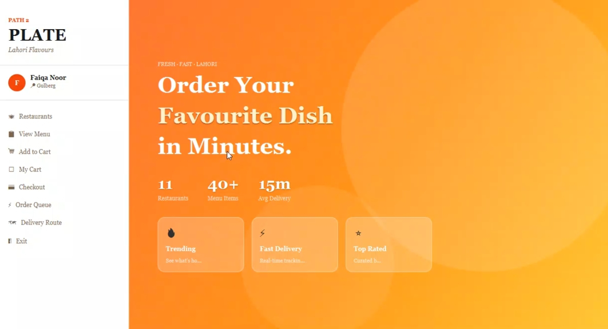

### 🍽️ Browse & Search Restaurants

  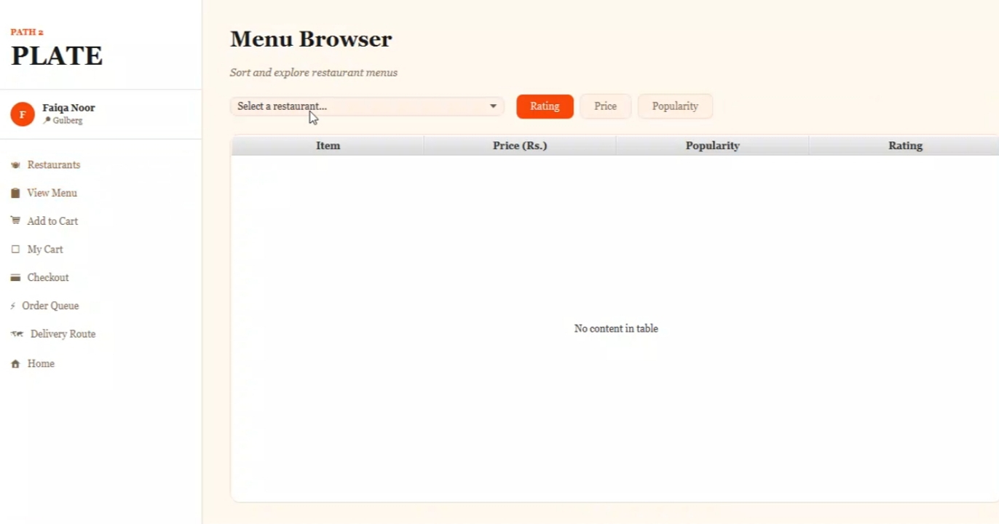
  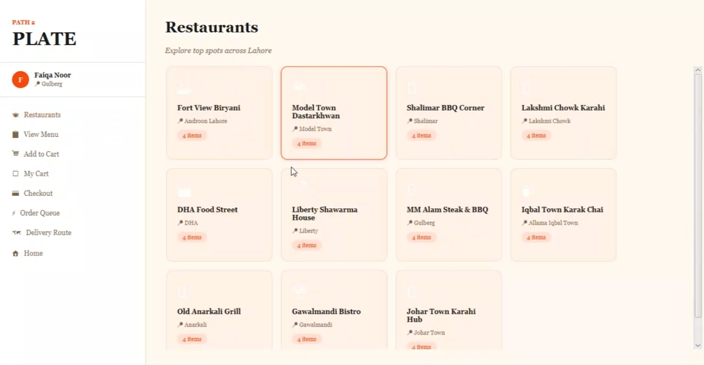
  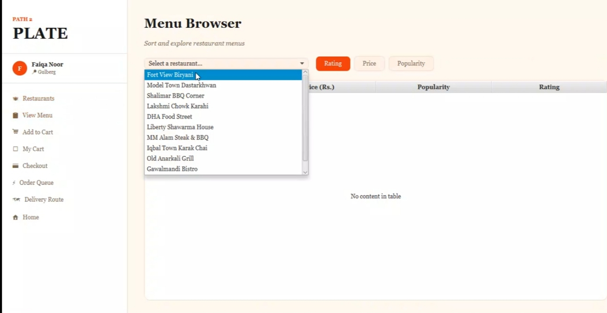

### 🛒 Cart & Orders

  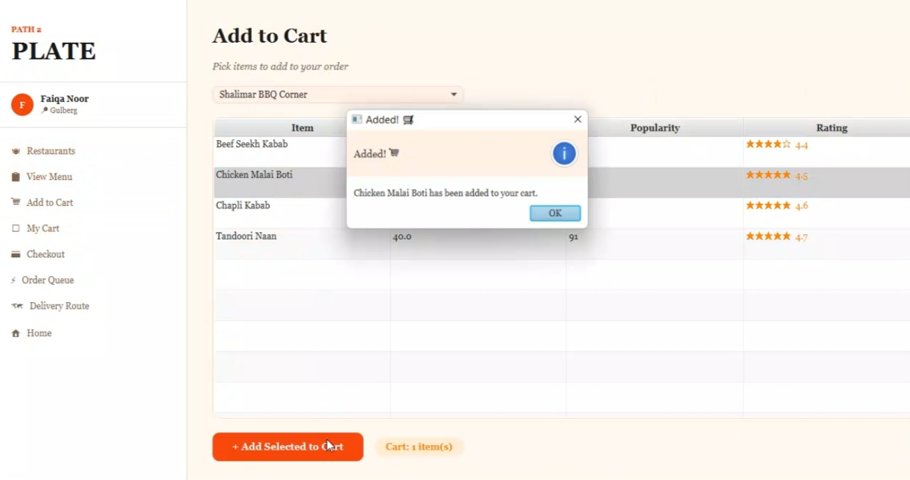
  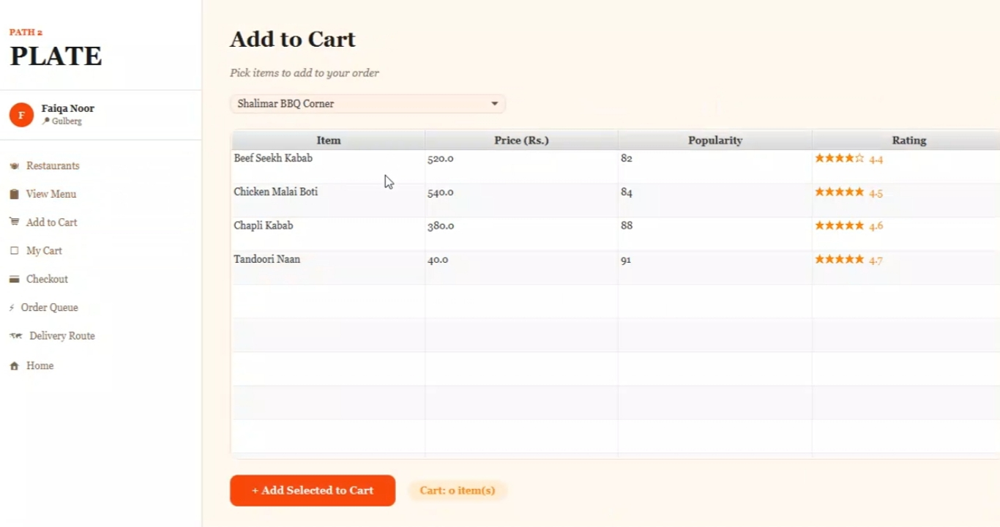
  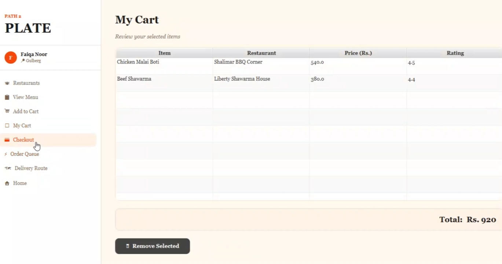
  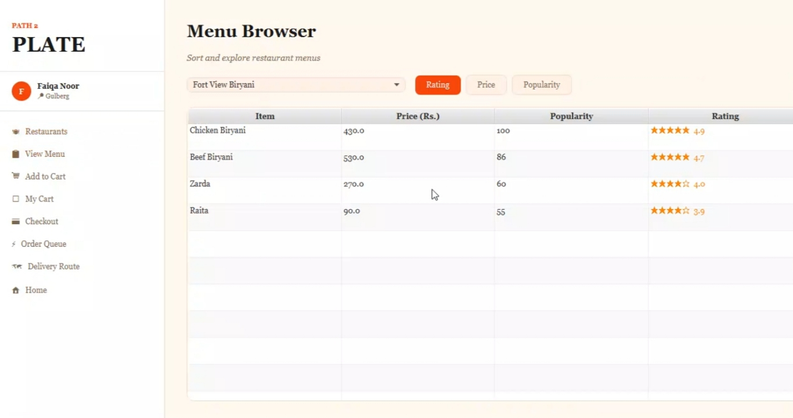

### 📦 Order Management

  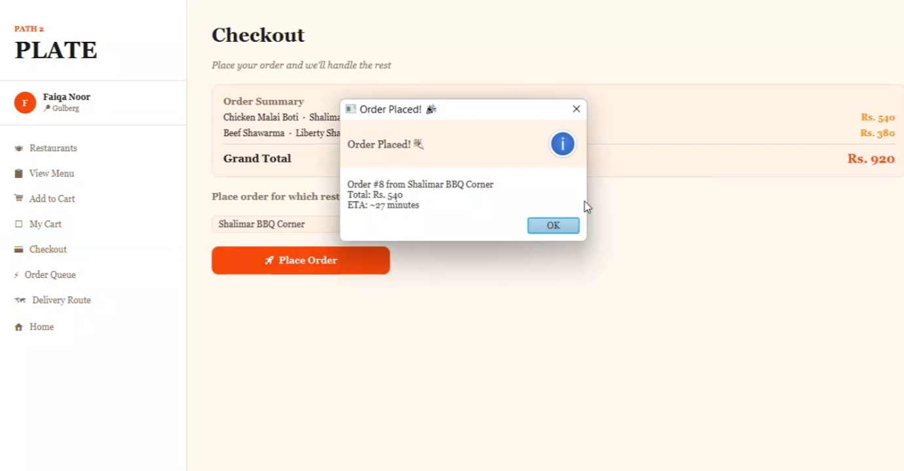
  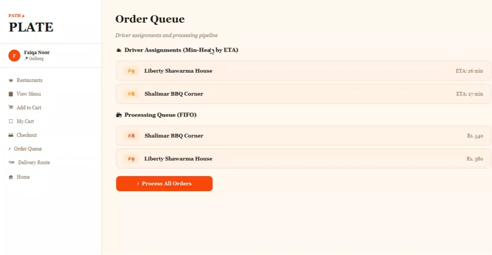
  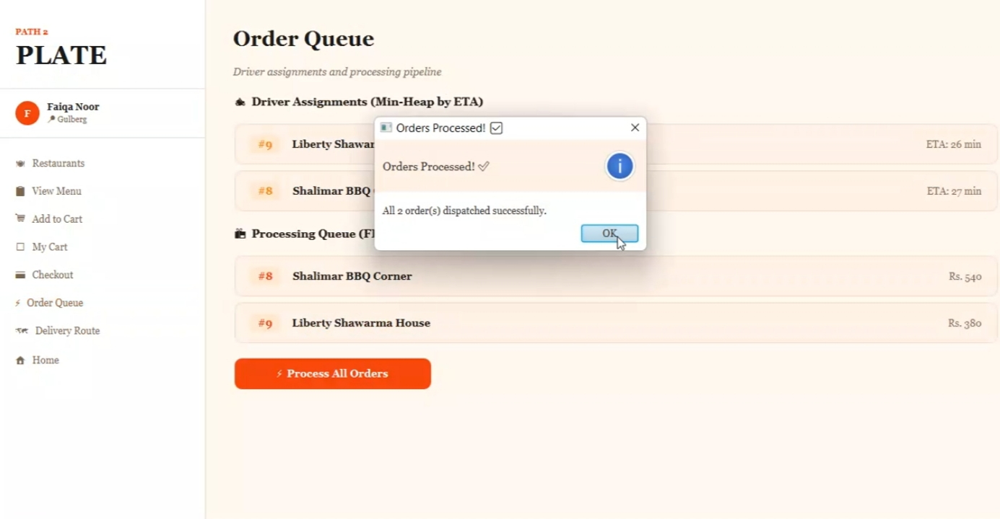
  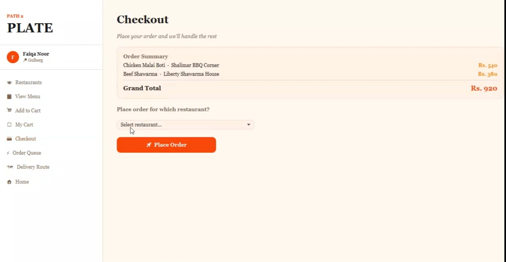

### 🚴 Delivery

  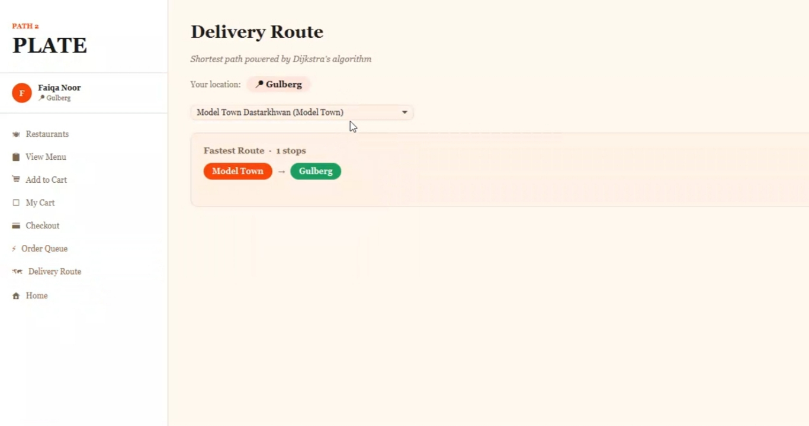

🚀 How to Run
Make sure you have Java JDK 11+ and JavaFX SDK installed

Clone the repository:
Code
Open the project in your IDE (IntelliJ / Eclipse / VS Code)
Make sure JavaFX is configured in your project settings
Run the Main.java file

👨‍💻 Author
Noor Ul Eman
GitHub: @nooruleman2006oct

